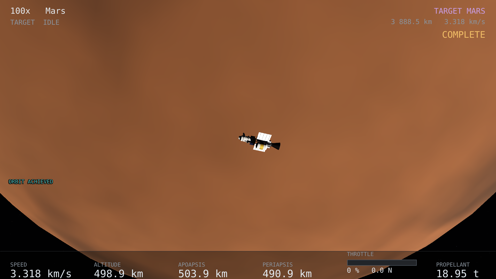

# spaceflight

Simulador científico de voo espacial no Sistema Solar.

Você pilota uma nave a partir de um cockpit 3D, planeja e executa missões —
órbita terrestre, Terra→Lua, Terra→Marte — e tudo o que acontece na tela sai de
física verificável: efemérides do JPL, gravidade de N corpos, propagação com
controle de erro e, em alta velocidade, relatividade especial e geral de campo
fraco, inclusive na imagem (aberração, Doppler, rotação de Terrell).



## Objetivos

Construir uma simulação interativa **fisicamente consistente** do voo de uma
nave pelo Sistema Solar, incluindo regimes relativísticos, com separação estrita
entre física, astronomia, visualização e gameplay.

Na prática:

* **O núcleo é uma biblioteca C++20 sem nada gráfico.** Compila, roda e é
  testado sem a apresentação. O jogo (`app/`, SDL3 + SDL_GPU + Dear ImGui) só
  desenha o que o núcleo entrega (ADR-0009); nada em `app/` calcula física.
* **O critério de sucesso é numérico, não visual.** Toda grandeza produzida é
  comparada contra uma referência externa (JPL Horizons/SPICE, REBOUNDx, solução
  analítica, medida experimental) com tolerância documentada.
* **Nada de atalhos que um jogo faria:** sem esferas de influência, sem `clamp`
  de velocidade, sem efeito visual que não venha de um modelo físico.

## Estado

**Milestone 8 concluído:** Sistema Solar inteiro desenhado a partir do SPICE,
planejador geral de missões e a viagem Terra→Marte voável do princípio ao fim
(204 dias, três queimas, órbita marciana de ~500 km).

O histórico de cada milestone, com o que foi medido e o que ficou por fazer,
está em [`docs/validation/`](docs/validation/) — o mais recente é
[`milestone-8-report.md`](docs/validation/milestone-8-report.md), que também traz o
backlog. Para aprender a pilotar, leia o
[manual do piloto](docs/manual/manual.pdf) e deixe a
[folha de atalhos](docs/manual/atalhos.pdf) ao lado do teclado.

## Requisitos

| | |
|---|---|
| SO | macOS arm64 (Metal) — qualificado. Linux (Vulkan) — compila e passa os testes de pixel em Vulkan por software; GPU de hardware a qualificar. Windows (Direct3D 12) — previsto, não compilado |
| Compilador | C++20: Apple clang ou GCC ≥ 13 |
| CMake | ≥ 3.24 |
| Ferramentas | `bash`, `curl`, `python3` (só stdlib), `git` |
| Disco | ~160 MB de downloads (CSPICE, kernels SPICE, SDL3 e as demais bibliotecas) |
| GPU | Metal, Vulkan ou Direct3D 12, para o jogo e para os testes de pixel |
| Opcional | Chrome/Chromium, para gerar o PDF do manual |

Não há nada a instalar além do compilador e do CMake: SDL3, Dear ImGui, stb,
glslang e SPIRV-Cross são baixados pelo próprio CMake, fixados por SHA-256.
Os dados de terceiros (kernels, catálogo estelar, toolkit NAIF) são baixados
pelos scripts, com checksum, e ficam fora do Git.

## Como rodar

### Compilar

```bash
./scripts/fetch_kernels.sh          # ~33 MB de kernels SPICE (DE440)
./scripts/fetch_star_catalog.sh     # 560 kB: Yale BSC5
cmake -S . -B build                 # baixa CSPICE, SDL3 e as demais dependências
cmake --build build -j
```

### O jogo

```bash
./build/bin/spaceflight
```

É um executável que roda sozinho. Para um pacote que se move inteiro — binário
mais texturas, kernels e catálogo:

```bash
cmake --install build --prefix ~/spaceflight
~/spaceflight/bin/spaceflight
```

Sem tela: `spaceflight --headless` imprime a leitura técnica,
`spaceflight --headless --destination Moon` voa a missão inteira, e
`spaceflight --shots m8 DIR` fotografa a viagem a Marte fora da tela. Controles:
[manual do piloto](docs/manual/manual.pdf),
[folha de atalhos](docs/manual/atalhos.pdf) (uma página, para imprimir) e a
tabela completa em [`docs/gameplay/controls.md`](docs/gameplay/controls.md);
todas as opções e o desenho da apresentação: [`app/README.md`](app/README.md).

### A CLI

```bash
./build/bin/orbit-cli body Earth --date 2026-01-01
./build/bin/orbit-cli propagate tests/scenarios/leo-raise-apoapsis.json
./build/bin/orbit-cli intercept tests/scenarios/lunar-intercept.json --to Moon --tof 4.5
```

Outros cenários em [`tests/scenarios/`](tests/scenarios/README.md).

### Testes

```bash
cmake --build build --target ctest-headless   # a física e a apresentação, sem GPU
cmake --build build --target gpu-validation   # os pixels; precisa de GPU, não de tela
```

Testes que dependem de algo ausente (kernels, GPU) saem com código 77 e
aparecem como `Skipped`, nunca como aprovados. `scientific.full_mission` pode levar
horas numa máquina modesta.

## Contribuir

### Antes de começar

1. Leia a [arquitetura do sistema](docs/architecture/system-architecture.md): a
   regra de dependência, as camadas e o mapa do repositório.
2. Leia os [ADRs](docs/adr/). As decisões registradas ali não se rediscutem sem
   uma razão técnica forte e demonstrável:

   | ADR | Decisão |
   |---|---|
   | 0001 | C++20 no núcleo; C só na fronteira com bibliotecas nativas |
   | 0002 | ~~Godot 4.x via GDExtension~~ — substituído pelo 0009 |
   | 0003 | CSPICE + DE440 como fonte autoritativa; a nave é partícula-teste |
   | 0004 | Estado em SSB / J2000 (ICRF), SI, TDB em representação de duas partes |
   | 0005 | Dormand–Prince 5(4) adaptativo, desacoplado de frame e de time warp |
   | 0006 | Dense output de 4ª ordem: estado em qualquer instante |
   | 0007 | Configuração em JSON com comentários, parser no core |
   | 0008 | Quaternions: escalar primeiro, Hamilton, corpo→inercial |
   | 0009 | Apresentação própria: SDL3 + SDL_GPU + Dear ImGui; nunca física |

### Regras que valem para toda mudança

1. **Nenhuma esfera de influência.** Todas as fontes gravitacionais contribuem em
   todo instante.
2. **Nenhum clamp.** `if (v > c) v = c` é proibido; o limite tem de sair da
   formulação ([`relativity-roadmap.md`](docs/physics/relativity-roadmap.md) §3).
3. **Documento → teste analítico → implementação → teste numérico.** Nunca efeito
   visual primeiro e física inventada depois. Cada modelo tem sua derivação em
   [`docs/physics/`](docs/physics/).
4. **Toda tolerância é justificada.** O harness de testes exige uma justificativa
   em cada comparação aproximada, e o número vai para
   [`docs/validation/tolerances.md`](docs/validation/tolerances.md).
5. **O core não conhece a apresentação.** Nenhum include de `app/` no core e
   nenhuma conta de física em `app/`; o shader recebe grandezas prontas do core.
6. **Uma única implementação.** Jogo, CLI e campanhas de validação entram pelas
   mesmas funções públicas do core; não se duplica astrodinâmica na ponte.
7. **Dívida conhecida é registrada, não escondida.** Se algo fica de fora, vai
   para o documento correspondente com o motivo e o caminho para pagar.

### Antes de abrir um PR

* `ctest-headless` passa (e `gpu-validation`, se a mudança toca o renderizador);
* build sem warnings novos — `-DSPACEFLIGHT_WERROR=ON` ajuda a garantir;
* o documento de física/arquitetura afetado está atualizado;
* se uma tecla mudou, `docs/gameplay/controls.md` foi regerado
  (`scripts/dump_controls.sh`) e o manual e a folha de atalhos recompilados (`scripts/build_manual.sh`).

### Onde está cada coisa

| Pasta | Conteúdo |
|---|---|
| [`app/`](app/README.md) | o jogo: sessão, apresentação, renderizador, shaders |
| [`core/`](core/) | o núcleo científico |
| [`docs/architecture/`](docs/architecture/) | camadas, coordenadas, navegação, renderização |
| [`docs/physics/`](docs/physics/) | derivação, domínio de validade e dívidas de cada modelo |
| [`docs/validation/`](docs/validation/) | relatórios de milestone, campanhas, tolerâncias |
| [`docs/gameplay/`](docs/gameplay/) | controles, cockpit, mapa, missões |
| [`docs/assets/`](docs/assets/) | estado e especificação de texturas, modelos e áudio |
| [`docs/manual/`](docs/manual/) | fonte do manual do piloto e da folha de atalhos |
| [`docs/PROMPT-0.md`](docs/PROMPT-0.md) | o enunciado original do projeto |
