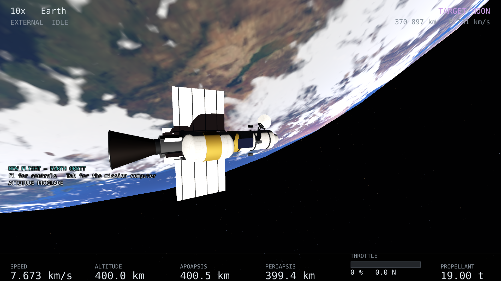

# A nave

Vinte e dois metros de veículo construído para ficar no vácuo. Não tem asas, não
tem leme e não tem carenagem: nada disso serve para nada onde não há ar.

<figure class="callouts" style="--w:1920;--h:1080">

<b style="{{anchor:external-spacecraft:cockpit}}">1</b>
<b style="{{anchor:external-spacecraft:habitat}}">2</b>
<b style="{{anchor:external-spacecraft:tanks}}">3</b>
<b style="{{anchor:external-spacecraft:radiators}}">4</b>
<b style="{{anchor:external-spacecraft:engine}}">5</b>
<figcaption>O empilhamento, do nariz para a cauda.</figcaption>
</figure>

1. **Módulo de comando e cockpit** — o nariz, com as janelas frontais.
2. **Habitat** — o casco pressurizado, com anel de acoplamento e vigias.
3. **Tanques** — dois, flanqueando a treliça, com manta térmica dourada.
4. **Radiadores** — dois painéis largos e finos. São o que mais diz "isto opera
   no vácuo": uma nave que não rejeita calor não existe.
5. **Motor principal** — o sino, e a seção de potência com a blindagem de sombra
   à frente dela. É por causa dessa blindagem que o habitat fica dez metros
   adiante.

## As medidas

| | |
|---|---|
| comprimento | 22,0 m |
| largura máxima | 14,0 m, ponta a ponta dos radiadores |
| casco pressurizado | 9 m × 3 m de diâmetro |
| volume habitável | ≈ 35 m³ |
| tripulação | quatro, para uma travessia de uma semana |
| massa | 20 t, das quais 19 t de propelente |

Trinta e cinco metros cúbicos para quatro pessoas dá 8,8 m³ cada. Para comparar:
a Orion tem 8,95 m³ **no total** para quatro. Esta nave é generosa pelos padrões
de uma cápsula e apertada pelos de uma estação, que é a proporção certa para ir
à Lua e voltar.

## O motor

Um reator de fusão com dois pontos de operação, e `{{key:engine_mode}}` alterna
entre eles. Os dois convertem a mesma potência (900 GW); o que muda é como ela é
gasta — muita massa devagar, ou pouca massa depressa.

| modo | empuxo | exaustão | para quê |
|---|---|---|---|
| `IMPULSE` | 200 kN | 0,030 c | manobras. Um g nesta nave; queima em minutos |
| `CRUISE` | 11,2 kN | 0,5 c | viagem longa. Um terço de g caindo a nada ao longo de anos |

O orçamento de Δv é absurdo para uma viagem à Lua: cerca de 0,09 c em `IMPULSE`,
vinte e seis mil quilômetros por segundo. Uma transferência translunar inteira
custa **uns 14 kg** de propelente dos 19 000 kg a bordo. Isso não é um erro do
mostrador: é a equação do foguete com uma velocidade de exaustão de 0,03 c.

### A cor da exaustão

A pluma não é um cone pintado: é gás que brilha, mais denso no eixo, que se
abre e se apaga à medida que se afasta do bocal. A cor diz em que regime o motor
está, e a mesma cor aparece na barra do acelerador e no empuxo do painel.

| cor | regime | por quê |
|---|---|---|
| rosa-magenta | `IMPULSE` — plasma de fusão denso | hidrogênio que esfria e se recombina brilha nas linhas de Balmer: o vermelho H-alfa mais o azul-violeta, que o olho soma em rosa |
| azul-branco | `CRUISE` — feixe relativístico | a 0,5 c o jato é tão fino e rápido que nada se recombina à vista da nave: brilha o feixe ionizado, estreito e longo |
| âmbar | motores químicos | uma chama no vácuo, que sem ar em volta se abre num cone largo e tênue |

Em `CRUISE` a pluma a pleno acelerador é uma pluma inteira, não uma pluma
dezoito vezes menor: o empuxo é medido contra o máximo do modo, e o jato carrega
a mesma potência. Contra a Terra iluminada de dia, a pluma fica discreta — gás
quente e rarefeito contra um fundo claro —, e no espaço escuro ela aparece.

Não há anéis de choque na pluma, e isso é deliberado: eles precisam de ar em
volta para refletir, e no vácuo não há.

## O RCS

Doze propulsores em seis binários, em braços de dois metros. Um binário produz
torque com força resultante **zero**, que é o que um RCS bem desenhado faz — e o
mesmo arranjo permite empurrar sem girar, disparando os dois propulsores que
apontam para o mesmo lado a partir de braços opostos.

Girar custa propelente do mesmo tanque, pela mesma física do motor principal. Não
há nenhum caminho neste simulador que gire a nave de graça.
