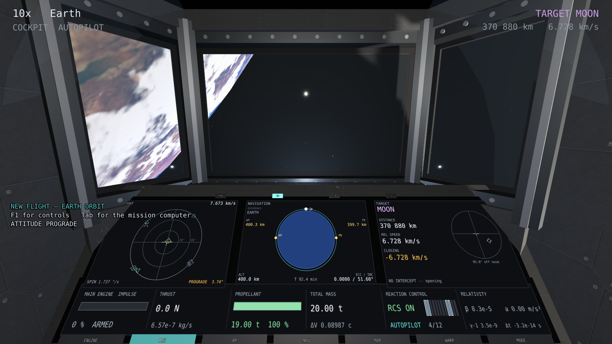

# O cockpit

## Onde as coisas estão, e porquê

O painel não está onde ficaria bonito: está onde cabe no campo de visão. A câmera
tem 75 graus verticais e a cabeça repousa 11 graus abaixo da linha do nariz, o
que torna visível a faixa de +26,5 a −48,5 graus. Daí saem as fileiras:

```
janelas             +2  a  +21 graus
lâmpadas                  −23
FLIGHT NAV TARGET         −28
SYSTEMS                   −43
botões                    −49      ← pede um olhar para baixo
```

Os botões estão na borda porque num cockpit de verdade também estão: você olha
para baixo para carregar neles, e isso é uma ação deliberada e não um acidente do
polegar.



## Olhar em volta

Arrastar com o **botão direito** vira a cabeça. Ela para em ±140 graus na
horizontal e ±73 na vertical, o que chega para ver os painéis laterais e o teto e
não chega para a cabeça atravessar a parede.

`{{key:camera_recentre}}` devolve o olhar à frente.

Girar a câmera **não é manobra**. A atitude continua onde o RCS a deixou e
nenhum número do estado muda.

## As lâmpadas

| | acende quando |
|---|---|
| `MSTR` | propelente abaixo de 10 % ou rotação acima de 6 °/s |
| `RCS` | há pelo menos um propulsor aberto |
| `ENG` | o motor principal está produzindo empuxo |
| `AP` | há um plano armado pilotando a nave |

## Os botões

Clicáveis com o mouse, com realce discreto ao passar por cima. Cada um chama
**exatamente o mesmo caminho** que a tecla correspondente — não há um segundo
comando escondido atrás do botão, e por isso o mouse e o teclado nunca discordam
sobre o estado da nave.

| botão | faz | tecla |
|---|---|---|
| `ENGINE` | acelerador cheio, ou corte | `{{key:throttle_full}}` / `{{key:engine_cutoff}}` |
| `RCS` | liga e desliga o RCS | `{{key:rcs_toggle}}` |
| `AP` | aponta prógrado | `{{key:point_prograde}}` |
| `NAV` | computador de missão | `{{key:nav_panel}}` |
| `MAP` | mapa orbital | `{{key:orbit_map}}` |
| `WARP` | sobe o time warp | `{{key:warp_up}}` |
| `MODE` | alterna `IMPULSE` / `CRUISE` | `{{key:engine_mode}}` |

## A luz

Duas luzes fracas e os próprios mostradores. O interior tem de ser legível **e** o
exterior tem de continuar observável, e o jeito de conseguir os dois não é
iluminar mais: é iluminar pouco, e deixar o contraste entre o painel aceso e a
penumbra fazer o trabalho.

A exposição é fixa. Com exposição automática, virar a cabeça da Terra para o
painel faria a cabine inteira pulsar de brilho.
