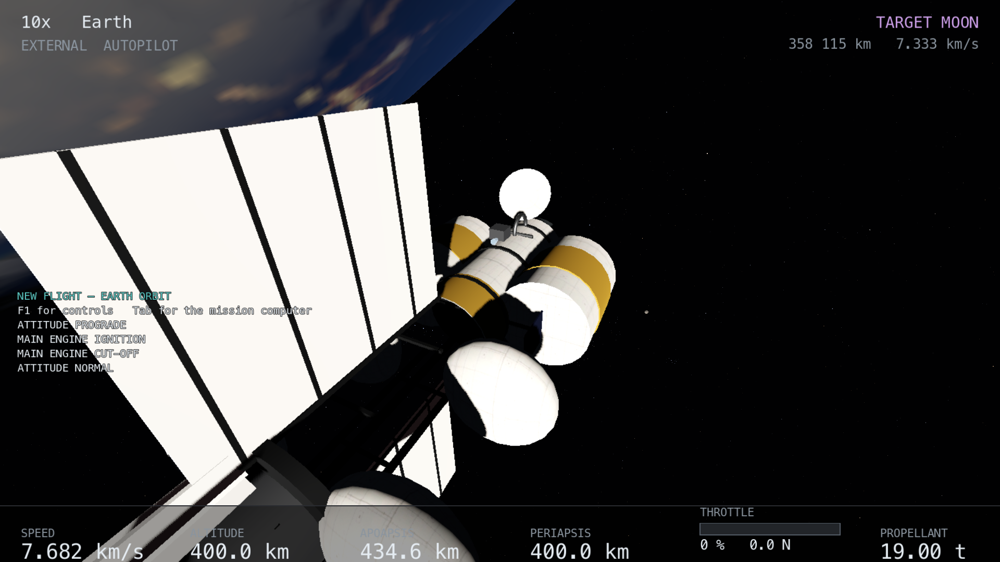
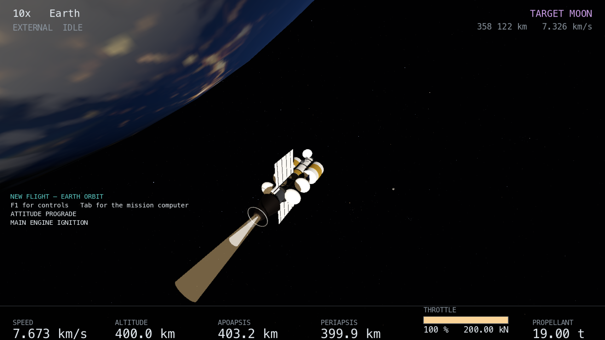

# Pilotar

Duas famílias de teclas, e a distinção é importante: **`WASD` move a nave e gasta
propelente; as setas movem a câmera e não mudam um número do estado.**

## Atitude

| | |
|---|---|
| `{{key:pitch_up}}` / `{{key:pitch_down}}` | arfagem |
| `{{key:yaw_left}}` / `{{key:yaw_right}}` | guinada |
| `{{key:roll_left}}` / `{{key:roll_right}}` | rolagem |

Cada tecla vira um **pedido de torque** ao RCS, que abre propulsores, que queimam
propelente. Não existe caminho da tecla até a orientação: a nave gira porque o
integrador resolveu as equações de Euler com o torque que os propulsores
produziram.

## Translação

| | |
|---|---|
| `{{key:translate_forward}}` / `{{key:translate_back}}` | à frente e atrás |
| `{{key:translate_left}}` / `{{key:translate_right}}` | para os lados |
| `{{key:translate_up}}` / `{{key:translate_down}}` | acima e abaixo |

Empurrar sem girar. O arranjo em binários permite: dois propulsores apontando
para o mesmo lado a partir de braços opostos dão força com torques que se
cancelam exatamente.

<figure class="callouts" style="--w:1920;--h:1080">

<b style="{{anchor:rcs-firing:jet}}">1</b>
<figcaption>Um dos seis bicos que o alocador abriu neste instante — o acelerador está a zero, e nada do que se vê aqui vem do motor principal.</figcaption>
</figure>

1. **O jato.** Um bico de RCS empurra 180 N contra os 200 kN do motor principal,
   e o que isso desenha tem 1,35 m num veículo de 22 m. É pequeno porque **é**
   pequeno: contar quais estão abertos é trabalho do instrumento de RCS, que diz
   "6 de 12" e desenha a abertura de cada um.

## Motor principal

| | |
|---|---|
| `{{key:throttle_up}}` / `{{key:throttle_down}}` | abre e fecha o acelerador, continuamente |
| `{{key:throttle_full}}` | acelerador cheio |
| `{{key:engine_cutoff}}` | corte |
| `{{key:engine_mode}}` | `IMPULSO` ↔ `CRUZEIRO` |

O empuxo sai ao longo do **nariz**. Para onde a queima vai é decidido por onde a
nave está apontando: aponte primeiro, abra o acelerador depois.

A pluma acende com o empuxo de verdade. Com o tanque vazio a tecla continua
funcionando, o empuxo é zero, e a pluma apaga.

> **`Shift` é acelerador e também o modificador de seis comandos.** Para que
> `Shift+P` não abra o acelerador de passagem, o acelerador só começa a mexer
> depois de o modificador ficar sozinho por 0,2 s — e fica bloqueado se um comando
> modificado disparar durante o toque. `{{key:throttle_full}}` e
> `{{key:engine_cutoff}}` não passam por nada disso: são imediatos.

## Apontamento automático

| | |
|---|---|
| `{{key:point_prograde}}` / `{{key:point_retrograde}}` | ao longo da velocidade, e contra |
| `{{key:point_normal}}` / `{{key:point_anti_normal}}` | o polo da órbita |
| `{{key:point_radial_out}}` / `{{key:point_radial_in}}` | para fora e para dentro |
| `{{key:point_hold}}` | manter a atitude atual |

O controlador é um PD com autoridade limitada pelo que os propulsores conseguem
entregar. Ele **assenta num atraso** e não chega a zero: um controlador que
persegue um alvo que gira fica atrás dele por volta de 2,6 graus. Isso não é um
defeito do simulador, é o que um controlador desse tipo faz.

Com uma missão armada, o plano pilota a nave e a simulação **recusa** o comando
manual em vez de aceitá-lo e sobrescrevê-lo no quadro seguinte. A mensagem diz
quem está com os controles.

## RCS

`{{key:rcs_toggle}}` liga e desliga. Desligar o RCS desliga o apontamento junto —
o controlador vive dentro do núcleo e continuaria pedindo torque, e um
interruptor que apagasse as chamas e deixasse o propelente sair seria a pior
espécie de mentira.

`{{key:rcs_mode}}` mostra o que o RCS está fazendo agora: `IDLE`, `ROTATION`,
`TRANSLATION`, `ROT+TRANS` ou `AUTOPILOT`.
