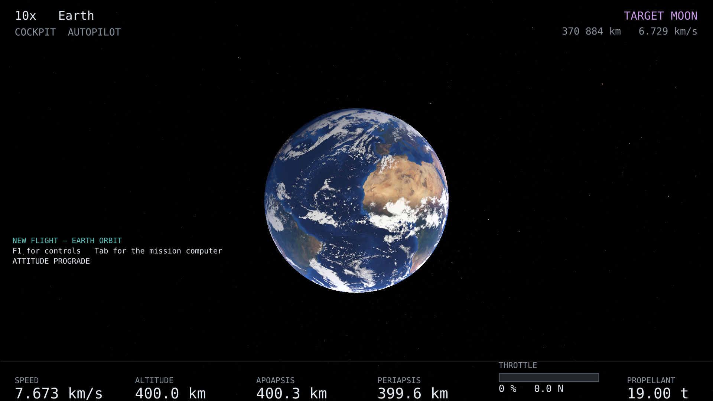

# As câmeras

`{{key:camera_cycle}}` percorre os cinco modos.

| modo | de onde olha | para quê |
|---|---|---|
| `COCKPIT` | a cabeça do piloto, no casco | pilotar |
| `EXTERNAL` | em torno da nave, nos eixos do casco | olhar a nave; azimute 180° é atrás da cauda |
| `CHASE` | atrás, no eixo da velocidade | ver para onde se vai |
| `VELOCITY` | o eixo da velocidade | olhar o céu, e a ótica relativística |
| `TARGET` | a linha do alvo | ver o alvo crescer |

## O mouse

| | |
|---|---|
| arrastar com o botão direito | no cockpit, virar a cabeça; fora dele, orbitar a nave |
| `{{key:camera_free_look}}` + arrastar | girar a câmera no lugar, deixando o alvo para trás |
| roda, ou `{{key:camera_zoom_in}}` / `{{key:camera_zoom_out}}` | aproximar e afastar, fora do cockpit |
| setas | virar a câmera pelo teclado |
| clique esquerdo | premir o botão do painel sob o ponteiro |

`{{key:camera_recentre}}` devolve tudo ao preset, zoom incluído. É a tecla para
quando você se perdeu apontando para o vazio.

`{{key:camera_focus_next}}` percorre os corpos celestes, um a um — o Sol, os
planetas, as luas — e depois volta à nave: a câmera passa a orbitar o corpo
escolhido. É assim que se olha um planeta inteiro.

## Por que há duas câmeras ao mesmo tempo

A cena usa uma unidade por milhão de metros: a Terra tem 6,371 unidades de raio e
a Lua fica a 358. O plano próximo da câmera tem de ser 50 km, senão as estrelas
somem por quantização de profundidade.

A nave tem 22 **metros**. Isso é duas mil vezes **dentro** desse plano próximo.
Não existe uma câmera só que desenhe a Lua a 358 unidades e um painel a meio
metro do seu rosto.

Então são duas, com a mesma orientação e o mesmo campo de visão: uma em unidades
de cena, outra em metros. Elas não são duas câmeras que se seguem — são a **mesma
câmera expressa em duas unidades**, e é por isso que a paralaxe entre a nave e o
planeta atrás dela sai certa em vez de ser ajustada.

O que isso custa, dito por inteiro: a camada próxima não é ocluída pela distante.
Um planeta nunca passa à frente do casco. Para uma câmera que ou está dentro da
nave ou a algumas dezenas de metros dela, isso não acontece.

## A ótica relativística

O céu é aberrado, deslocado em frequência e re-brilhado pela velocidade da nave,
com 8 786 estrelas reais do catálogo Yale BSC5. A 7,7 km/s o efeito existe e é
desprezível — o Doppler é `1 ± 10⁻⁴` — que é exatamente o que tem de ser nessa
velocidade.

Para ver os efeitos é preciso ir depressa, e a única maneira honesta é queimar
por oito anos: `{{key:cruise_burn}}` faz isso numa tecla — modo `CRUISE`,
prógrado, acelerador cheio, warp máximo. Alguns minutos de espera e o céu à
frente empilha-se num cone.

Os quatro interruptores de ótica desligam os efeitos um a um, para que a
diferença seja **vista** em vez de discutida: `{{key:optics_aberration}}`,
`{{key:optics_doppler}}`, `{{key:optics_beaming}}`, `{{key:optics_light_time}}`. O
estado da nave é bit a bit o mesmo dos dois lados; o que muda é qual pergunta o
renderizador faz.

Para comparar velocidades sem esperar anos, `{{key:visual_beta}}` percorre uma
escada de β **visual** — o voo real, depois 0, 0,1, 0,5, 0,9 e 0,99 —, que muda só
o que o renderizador desenha. `{{key:body_scale}}` exagera o tamanho desenhado dos
corpos, para achá-los de longe; é só desenho, e a 1000× a câmera pode acabar
dentro da Terra (ver *Quando algo parece errado*).

`{{key:exposure_up}}` e `{{key:exposure_down}}` ajustam a exposição do céu.
