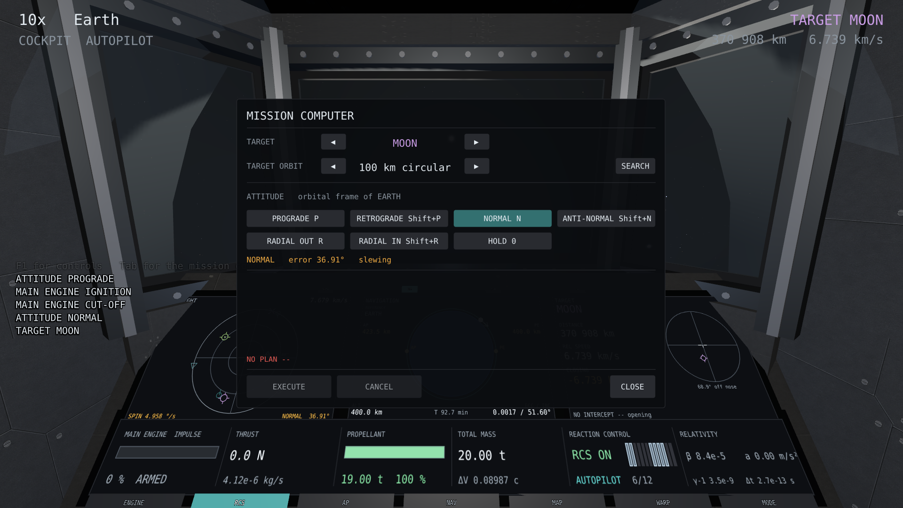
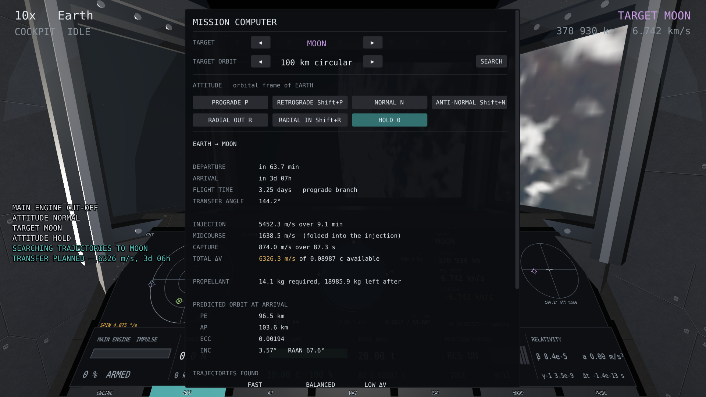
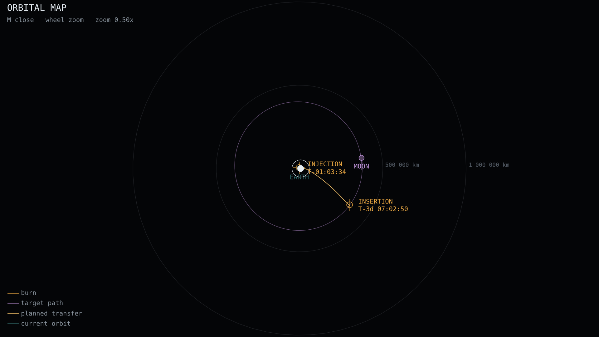
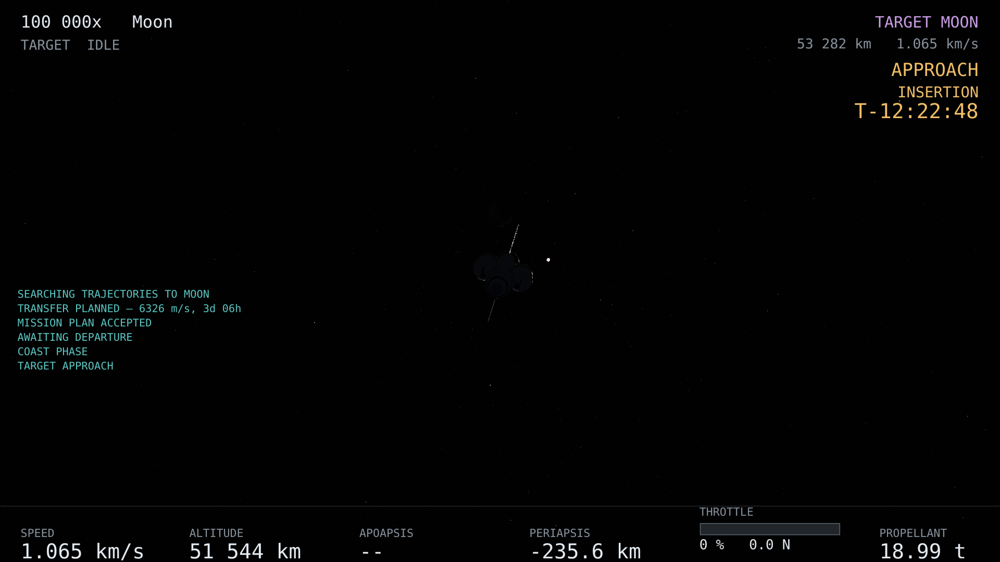
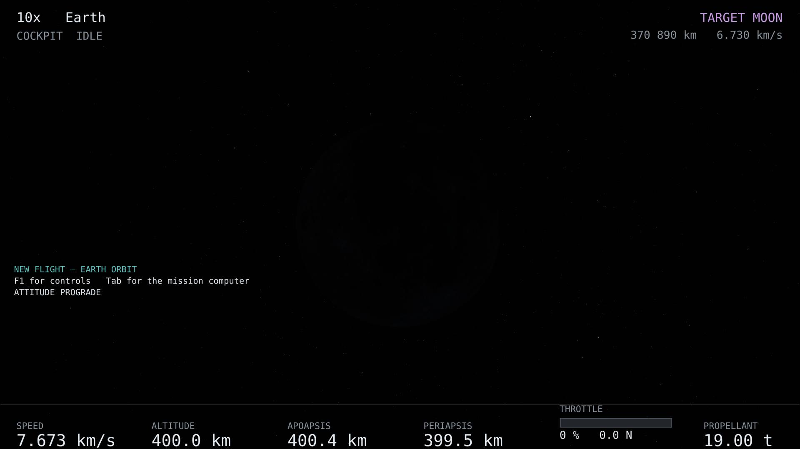
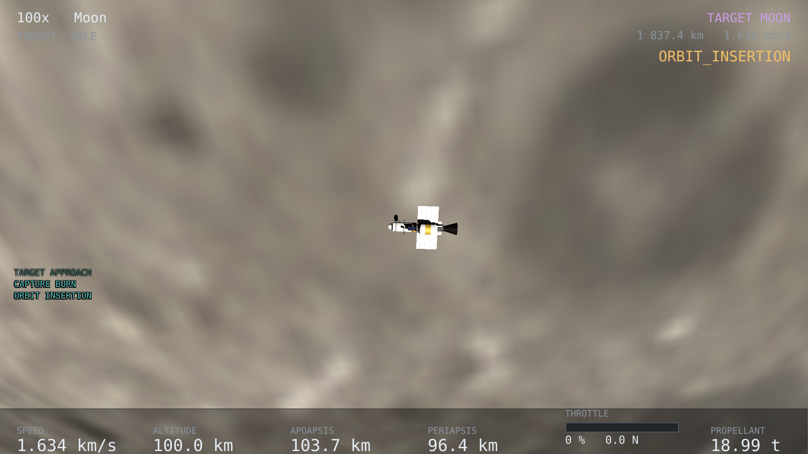

# A missão Terra–Lua

O roteiro completo, do estacionamento em órbita terrestre à órbita lunar.

```
{{key:nav_panel}}        abre o computador de bordo
    ↓
TARGET, TARGET ORBIT     ◀ ▶  o destino e a altitude de chegada
    ↓
SEARCH                   a busca roda ao fundo, com progresso na tela
    ↓
ler o resumo             Δv por queima, propelente, órbita prevista
    ↓                    e, se quiser, USE outra trajetória da tabela
EXECUTE                  arma as queimas
    ↓
{{key:warp_up}}          e deixar o warp levar os três a cinco dias
    ↓
órbita lunar
```

## 1. Escolher o alvo



O alvo já é a Lua num voo novo. Os ◀ ▶ de `TARGET` — ou `{{key:target_prev}}` e
`{{key:target_next}}` — percorrem os corpos que são **lugares**: o Sol, os planetas
e as luas. Baricentros não aparecem, porque um baricentro é um ponto no vazio e
não um destino.

`TARGET ORBIT` escolhe a altitude da órbita circular de chegada, de uma lista:
50, 100, 200, 300, 500, 1000 ou 2000 km. Ao trocar de alvo ela volta ao padrão —
100 km para a Lua, 500 km para os demais.

A fileira `ATTITUDE`, logo abaixo, aponta a nave nas direções da órbita atual; é
a mesma coisa que as teclas de apontamento, e está descrita em *Pilotar*.

## 2. Planejar

`SEARCH` — ou `{{key:mission_plan}}` — começa a busca. Ela **não trava o jogo**:
roda numa tarefa ao fundo enquanto a nave continua voando, e o painel mostra o
que está acontecendo:

```
SEARCHING TRAJECTORIES — <etapa>
  candidates tested 18 of 24   flown 4   found 3   12k integrator steps
```

Planejar é procurar oportunidades de partida e depois voar cada candidata com o
modelo completo, o que são dezenas de propagações de trajetória. Enquanto isso o
botão vira `CANCEL SEARCH`, que interrompe a busca entre uma candidata e a
seguinte.



O que o resumo diz:

| | |
|---|---|
| `DEPARTURE` | quanto falta para a ignição |
| `ARRIVAL` | quanto falta para a chegada |
| `FLIGHT TIME` | quantos dias de voo, e qual ramo |
| `TRANSFER ANGLE` | o ângulo varrido entre a partida e a chegada |
| `INJECTION` | o Δv e a duração da queima de partida |
| `MIDCOURSE` | a correção, embutida na injeção e não uma queima separada |
| `CAPTURE` | o Δv e a duração da queima de captura |
| `TOTAL ΔV` | a soma, contra o que a nave tem |
| `PROPELLANT` | quanto custa, e quanto sobra |
| `PREDICTED ORBIT AT ARRIVAL` | periapsis, apoapsis, excentricidade, inclinação, RAAN |

### As trajetórias encontradas

Abaixo do resumo vem `TRAJECTORIES FOUND`: até três das geometrias que a busca
**de fato voou** e que chegam ao alvo, lado a lado e ordenadas pelo tempo de voo.
Com três, elas se chamam `FAST`, `BALANCED` e `LOW ΔV`; com duas, `FASTER` e
`CHEAPER`. Cada coluna mostra o tempo de voo, o Δv de partida, o de captura, o
total, a órbita de chegada e a inclinação. Os botões `USE` escolhem uma delas, e
o plano passa a ser aquele.

As geometrias que a busca voou e recusou aparecem em `REFUSED`, cada uma com o
motivo da recusa.

A tabela está ali porque o planejador **não mira uma inclinação**: a inclinação
em que você acaba é consequência da geometria de partida, e mostrar as
alternativas é como o planejador diz isso em vez de esconder.

> O tempo de voo **não** é um parâmetro. Ele é o que a busca decide. Fixá-lo é
> precisamente o defeito que fez uma campanha anterior falhar em 82 % das suas
> épocas: com o ponto de partida e o tempo de voo ambos presos, o ângulo de
> transferência é o que o calendário disser.

## 3. Inspecionar

Planejar **não arma**: o plano fica à vista até você mandar executá-lo. `CANCEL`
descarta; `CLOSE` fecha o painel e mantém o plano.

`{{key:orbit_map}}` mostra a transferência no mapa antes de você decidir.



## 4. Executar

`EXECUTE` — ou `{{key:mission_execute}}` — instala as queimas. A partir daí o plano
pilota: a nave se orienta sozinha para a injeção, o motor acende na hora, e a
lâmpada `AP` acende. A fase aparece no canto superior direito com o nome técnico
(`WAITING_FOR_DEPARTURE`, `INJECTION_BURN`…) e a contagem para o próximo evento;
cada mudança de fase é anunciada nas mensagens da nave:

```
TRANSFER PLANNED → AWAITING DEPARTURE → ORIENTING FOR INJECTION
→ INJECTION BURN → MIDCOURSE CORRECTION → COAST PHASE → TARGET APPROACH
→ ORIENTING FOR CAPTURE → CAPTURE BURN → ORBIT INSERTION → ORBIT ACHIEVED
```

`MISSION ABORTED` e `MISSION FAILED` são os dois finais fora do roteiro.

## 5. A travessia

`{{key:warp_up}}` até 100 000× e a viagem leva alguns minutos de relógio de parede.
`{{key:camera_cycle}}` até `TARGET` para ver a Lua crescer. Ao se aproximar, o
corpo de referência passa sozinho da Terra para a Lua, e os números de órbita
passam a ser em torno dela.



## 6. A chegada



A queima de captura acontece sozinha. Quando ela termina, `{{key:debug_hud}}`
confirma — num voo da data padrão, sem tela:

```
about Moon      CAPTURED   1838.9 km at 1632.1 m/s
  orbit        96.0 x 103.8 km altitude, e 0.0021, i 2.56 deg, 117.8 min
predicted      96.1 x 103.7 km, e 0.0021, i 2.56 deg, RAAN 70.2 deg
propellant     13.72 kg required, 18986.28 kg left after
```



O mostrador técnico também mostra uma tabela de **previsto contra realizado**:
periapsis, apoapsis, excentricidade, inclinação, propelente e Δv de captura, com
a diferença entre o que o planejador disse e o que a integração fez. É a linha
que diz se o simulador prevê a própria física.

## Abortar

`{{key:mission_abort}}` cancela o plano e devolve a atitude ao piloto. A nave
**não** volta magicamente para a Terra: ela fica exatamente no estado físico em
que está, com a velocidade que tem, e o controle é seu.
