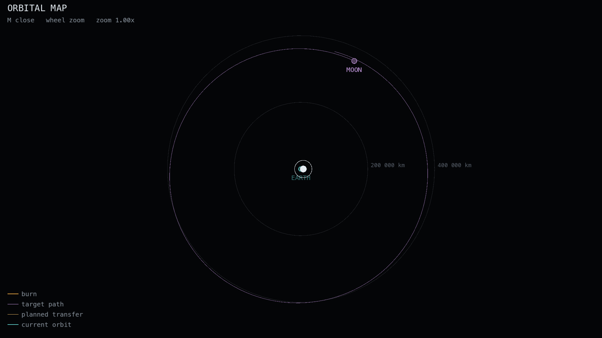

# O mapa orbital

`{{key:orbit_map}}` abre e fecha. A roda do mouse faz zoom.

| linha | o que é |
|---|---|
| ciano | a órbita atual |
| âmbar | a transferência planejada |
| violeta | o caminho do alvo |
| cruz com anel | uma queima, com o tempo até ela |

Os anéis concêntricos são escala, com a distância rotulada. Sem eles o mapa fica
bonito e não diz distância nenhuma, que é a sua única função.

## O que o mapa não faz

Ele não calcula nada. Os quatro conjuntos de pontos vêm prontos do núcleo:

| | de onde |
|---|---|
| órbita atual | os elementos osculadores, amostrados |
| caminho do alvo | a **efeméride**, amostrada |
| transferência | o arco que o planejador de fato voou |
| queimas | as épocas do plano |

O caminho da Lua é amostrado da efeméride e **não** de uma elipse, e a diferença
é observável: o perigeu e o apogeu lunares diferem em mais de 40 000 km, o que
uma elipse desenhada não daria.

## A projeção

O plano do desenho é o que contém o corpo central, a nave e o alvo. Isso não é
uma escolha estética: a órbita de estacionamento tem 51,6 graus de inclinação e a
Lua anda perto da eclíptica, e projetar sobre o plano da órbita atual encurtaria
a Lua até ela cair em cima da Terra — a 384 000 km de distância, desenhados como
zero.

O que se perde é a inclinação relativa entre os dois, que este mapa não promete
mostrar.
