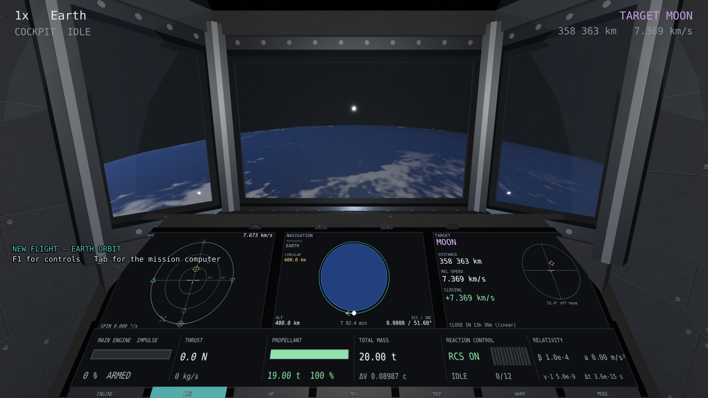

# O manual do usuário

Fonte do `manual.pdf`. Um capítulo por arquivo, em Markdown, numerados pela ordem
em que aparecem.

```bash
./scripts/build_manual.sh     # regenera as teclas e compila o PDF
```

## Como isto se mantém vivo

Um manual envelhece de três maneiras, e as três **reprovam a compilação** em vez
de imprimir uma coisa errada.

| no Markdown | resolve para | falha se |
|---|---|---|
| `{{key:camera_cycle}}` | a tecla, vinda da tabela de teclas | a ação não existe mais |
| `{{include:../gameplay/controls.md}}` | o arquivo, inline | o arquivo não existe |
| `` | a figura | a figura não existe |
| `{{anchor:external-spacecraft:engine}}` | onde a peça caiu NA imagem | a captura não tem essa âncora |

As teclas vêm de `docs/gameplay/controls.json`, que sai de
`app/presentation/input_actions.cpp` por `scripts/dump_controls.sh`. **Nenhuma
tecla é escrita à mão neste diretório.** Renomeie uma ação e o manual reprova;
mude uma tecla e o manual acompanha sozinho.

As figuras vêm de `scripts/m7_screenshots.sh`, que voa a demonstração inteira
sozinho e é reproduzível. Depois de uma mudança visual, rode-o e o manual passa a
mostrar o novo estado.

## A cadeia

```
docs/manual/*.md ─┐
docs/manual/manual.css ─┤
docs/gameplay/controls.json ─┼─► scripts/build_manual.py ─► build/manual/manual.html
docs/validation/m7/*.png ─┤                                        │
docs/validation/m7/*.anchors.json ─┘                               │
                                                            Chrome --print-to-pdf
                                                                   │
                                                      docs/manual/manual.pdf
```

Sem pandoc, sem LaTeX, sem dependências de Python. O renderizador de Markdown
cobre o subconjunto que estes capítulos usam e nada mais; o PDF sai do Chrome,
que é o único motor de impressão instalado nesta máquina.

## Escrever um capítulo

Numere o arquivo pela posição (`05-...`), comece com um `# Título` — que vira a
entrada do sumário — e escreva Markdown normal. HTML cru passa direto, que é como
as figuras com chamadas numeradas são feitas:

```html
<figure class="callouts" style="--w:1920;--h:1080">

<b style="--x:26;--y:70">5</b>
<figcaption>...</figcaption>
</figure>
```

`--x` e `--y` são **porcentagens da imagem**. Mover uma chamada é editar dois
números no mesmo arquivo em que está a legenda, sem recompor imagem nenhuma.

### Chamadas que se calculam sozinhas

Coordenadas escritas à mão envelhecem **em silêncio**: basta a câmera mudar de
enquadramento para o número "motor principal" passar a apontar para um radiador,
sem que nada falhe. Quando a chamada marca uma peça da NAVE, dê a posição dela em
metros no referencial do corpo e deixe a câmera projetar:

```cpp
// app/presentation/shot_director.cpp
[this] { return ship_anchors(); }   // nome -> Vec3, em metros
```

A captura grava um `<figura>.anchors.json` ao lado do PNG e o capítulo escreve:

```html
<b style="{{anchor:external-spacecraft:engine}}">5</b>
```

As posições vêm das constantes de `SpacecraftVisual` — a mesma fonte que desenha
o casco. Mude o enquadramento, rode a captura, e os marcadores acompanham.

Os marcadores do HUD e do painel do cockpit continuam escritos à mão, e podem:
a câmera do cockpit tem pose fixa e o HUD é espaço de tela.

Arquivos que começam com `_` e o `README.md` não entram no PDF.
